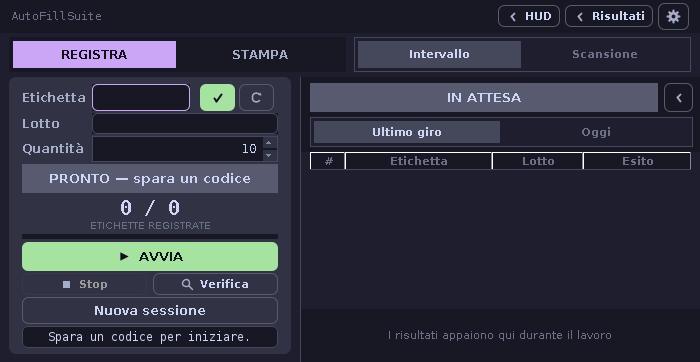
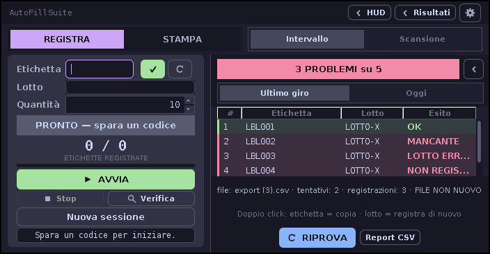
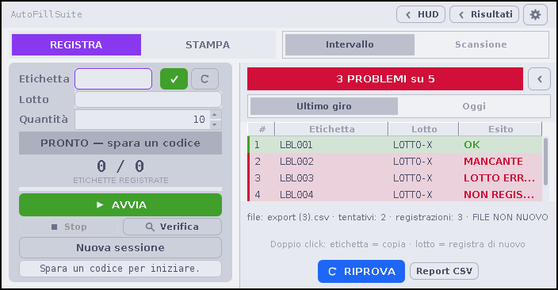

<div align="center">

# AutoFillSuite

A desktop app that registers hundreds of cable labels on an API-less supplier
portal by driving mouse and keyboard, then checks its own work against the
portal's CSV export.

**Desktop automation with a trust problem — solved by never trusting itself.**


One operator, hundreds of cable labels, a supplier portal with no API.
AutoFillSuite drives the browser the way a hand would — `java.awt.Robot`
clicks, pastes, TABs — and then **diffs every run against the portal's own
CSV export** before anything counts as done.



*A full run in the test environment: rows land live, verification runs, the
run goes green only when the export agrees.*

</div>

---

## At a glance

| | |
|---|---|
| **Stack** | Java 8+, Swing, `java.awt.Robot` — nothing else |
| **Trust model** | the robot's keystrokes are never the record; the portal's export is |
| **Tests** | 250 checks in 10 plain-JDK suites, each born from a real bug, all in CI |
| **Delivery** | one standalone JAR, no installer, no runtime downloads |
| **Status** | in daily production use on the shop floor |
| **UI** | hand-rolled Catppuccin design system, Mocha / Latte |

| Mocha | Latte |
|---|---|
|  |  |

*Shots from the test environment against the bundled demo portal — no
production data. The working HUD lives in
[docs/screenshot-hud.png](docs/screenshot-hud.png).*

---

## The loop

```
 scanner / range          ┌──────────────┐    click · paste · TAB · ENTER
─────────────────────────▶│  AutoFill    │───────────────────────────▶ portal
                          │  Suite       │
 results table   ◀────────│  (cockpit)   │◀── fresh CSV ◀──── Export CSV click
 report · log             └──────┬───────┘    DownloadWatcher
                                 │
                       RegistrationVerifier
                green ONLY with: 0 missing · 0 unregistered · 0 wrong lot
```

## Design principles

- **Verify, don't trust.** After every run the app clicks the portal's own
  **Export CSV**, waits for the fresh file, and diffs the whole export
  against what it just sent.
- **The export is the ground truth.** The portal appends — it never edits —
  so a re-registered label raises its count (`OK ×2`), it is not a problem.
  Missing, unregistered and wrong-lot rows are.
- **Fail-safe by default.** Move the mouse and the run stops. The app is
  always-on-top, so before every run it checks whether it is *covering* one
  of its own click targets and steps aside — or refuses to start. A run the
  app never got to verify is offered for verification at the next launch.
- **Tested before trusted.** Plain-JDK harnesses, no frameworks, every suite
  born from a real failure: emoji that rendered as empty boxes on Windows
  (`GlyphSafetyTest`), a gear icon whose hub came out as a black disc on the
  opaque backbuffer (`IconRenderTest`), a queued pair painted green before it
  was ever sent (`RunTableModelTest`), a log format that drifted from its own
  parser (round-trip test), a spinner that displayed 20 and printed 30
  because a focusless button never commits an edit (`SpinnerCommitTest`).
- **Measured, never hard-coded.** Window, HUD and settings heights come from
  `pack()` and honest preferred sizes — the same layout survives any
  platform's title bar and font metrics.
- **Zero dependencies.** JDK 8 API only. One JAR, no installer, nothing to
  update on a production floor PC.

## Modes

**REGISTRA · a intervallo** — scan one label, set a quantity: the app derives
the range (`ABC001 → ABC010`) and registers every serial with the batch, one
robot burst per label, fixed or randomized cycle timing. State banner
(PRONTO → REGISTRAZIONE → VERIFICA → TUTTO OK / PROBLEMI), live counter,
live results table, one-press **Nuova sessione** reset.

**REGISTRA · a scansione** — two QRs per item (label + lot), built around a
**queue**: a scanned pair goes into the queue and the fields clear at once,
so the operator scans at their own pace and nothing is lost. A worker drains
the queue one short burst at a time, only when the scanner has been quiet
for a moment — never mid-scan. Two tempos: **Continuo** (fire as they come,
PAUSA any time) or **A blocco** (collect everything, release with ▶). The
session is verified against the export every N pairs, or on demand.

**STAMPA** — the portal's print form ignores its own quantity field: any
value above 1 only changes the numbering step (2 → 2,4,6,8…), still emitting
**one label per click**, so producing N labels means N manual clicks. This
mode keeps the field at 1 and does the clicking — N presses of the print
button with a configurable pause. It is where AutoFillSuite started.

## Post-run verification

1. The robot clicks the memorized **Export CSV** coordinate
2. `DownloadWatcher` picks up the fresh download by timestamp (newer than
   the click) and size stability — never by filename
3. `RegistrationVerifier` diffs the whole export against the run
4. One row per label, colored by verdict; every outcome appended to the
   verification log

The results panel toggles between **Ultimo giro** (the last run) and **Oggi** (everything registered today) — a view switch only; the daily report keeps filing every run regardless. Double-click a row's **Lotto** cell to register that label again (same lot re-sends it, a new lot corrects it); double-click elsewhere to copy the label.

Retries re-click the export, so a slow server never produces a false red.
Manual **Verifica** falls back to the newest export already in the folder —
flagged as *not fresh*. Auto-verification is a **per-mode choice**: range
and scan each own their toggle in their own ⚙ tab.

**Daily report** — one CSV per day for the quality office, one section per
run, and it **writes itself**: every send is journaled the moment it happens
(coalesced, off the EDT), so the end-of-day file holds every code with its
exact time even if nobody ever presses a button — the send time comes from
the app itself, because the portal's export has no timestamps. Rows read
`Etichetta;Lotto;OraInvio;Esito;Registrazioni;Dettaglio`; a verification
replaces the run's live section with real verdicts, RIPROVA rewrites it in
place, and the Report CSV button remains as a manual re-save.

**HUD** — while the robot works the window drops to a slim bar at the
bottom (band, counter, STOP) and restores itself when the verification
ends. After every verification the app returns to the front with the caret
in the scan field — ready for the next round.

## Architecture

```
src/
└── app/
    ├── Main.java                    # Entry point, system look & feel
    ├── core/                        # Robot, tasks, watcher, verifier, report
    ├── ui/                          # Cockpit, theme, panels, table, HUD
    └── config/                      # Write-through .properties settings
```

The dependency rule: **core never imports ui** — `VerificationTask` talks to
a listener and delivers every callback already on the EDT, so panels never
think about threads. The full walkthrough, decision by decision, lives in
[docs/ARCHITECTURE.md](docs/ARCHITECTURE.md).

**User manuals:** [English](docs/MANUAL.en.md) ·
[Italiano](docs/MANUAL.it.md)

## Tests

Plain-JDK harnesses, zero external dependencies:

```bash
javac --release 8 -d out $(find src test -name '*.java')
java -cp out app.core.RegistrationVerifierTest   # the diff logic
java -cp out app.core.DownloadWatcherTest        # fresh-file pickup
java -cp out app.core.VerificationTaskTest       # click/wait/retry loop
java -cp out app.core.CoreExtrasTest             # guard, report, history, log round-trip
java -cp out app.ui.GlyphSafetyTest              # no emoji in UI strings
java -cp out app.ui.IconRenderTest               # icons render as pixels, hub is a hole
java -cp out app.ui.RunTableModelTest            # uncovered rows never fake green
java -cp out app.ui.SpinnerCommitTest            # typed values reach the model
java -cp out app.ui.TextFitTest                  # overflowing text keeps its tail
xvfb-run -a java -cp out app.ui.StartupSmokeTest           # first run
xvfb-run -a java -cp out app.ui.StartupSmokeTest --saved   # restart, every setting saved
```

Fixtures are synthetic but shaped on real exports: header row, append-style
registration pairs, free-text lots with double spaces, the browser's
` (N).csv` dedup naming.

### Local test site

`test-site/lifecycle-test.html` — a single-file, offline mock portal that
reproduces the *behaviour* the automation must handle, deliberately unlike the
real portal in look and data: its own neutral styling, invented item codes and
batches, generic column names. What it keeps is the **interaction contract** —
the same field/TAB order, the same SAVE semantics (the button is
`type="button"`, so ENTER in the batch field does *not* save; the robot must
TAB onto SAVE and press ENTER there), an append-only store, and a
pipe-separated CSV export. Fault-injection knobs — lost registrations,
corrupted batch, server lag, print-before-register row — reproduce every
failure class the verifier must catch, so the whole loop
(robot → export → diff → retry → results) can be tested end to end without
touching production. No asset, code, identifier or data from the real portal
is included.

## Requirements · Build · Run

Java 8 or higher; Windows, Linux, macOS (display access required —
`java.awt.Robot` needs system input permissions).

```bash
ant run        # build and run (or open in Apache NetBeans and press F6)
ant jar        # produce dist/AutoFillSuite.jar
java -jar dist/AutoFillSuite.jar
```

Setup in one line: memorize the portal coordinates once in **⚙**, pick a
mode, press **AVVIA**. To stop: **Stop**, or just move the mouse.

## Related

Same discipline, different stack:
[arch-bootstrap](https://github.com/importriri/arch-bootstrap) ·
[arch-hypervisor-lab](https://github.com/importriri/arch-hypervisor-lab) ·
[privatestack-ansible](https://github.com/importriri/privatestack-ansible)

## License

MIT — free to use, modify and distribute with attribution.
