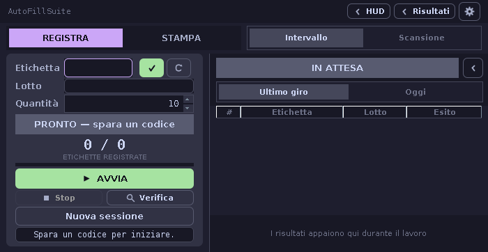
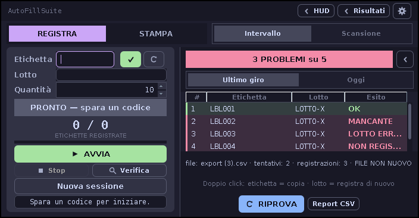
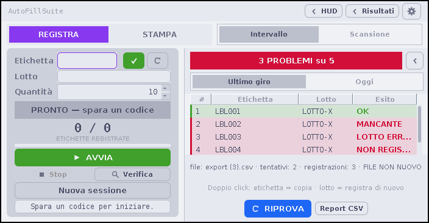

<div align="center">

# AutoFillSuite

A Java/Swing desktop tool for registering cable labels on a supplier portal
that has no API, then checking the result against the portal's CSV export.

[](https://github.com/importriri/AutoFillSuite/actions/workflows/tests.yml)
[](https://github.com/importriri/AutoFillSuite/actions/workflows/lint.yml)



</div>

## Why it exists

The portal accepts keyboard and mouse input but provides no API. AutoFillSuite
uses `java.awt.Robot` to perform the repetitive input, but it never treats the
keystrokes as proof. After a run, it downloads a fresh CSV export and compares
the portal's records with the labels that were attempted.

The tool is used on a production-floor Windows PC and remains a standalone Java
8 JAR with no runtime dependencies.

## Workflows

### Range registration

Scan the first label, enter a quantity and choose the timing. The application
builds the serial range and sends one portal transaction per label.

### Queued QR scanning

Scan a label QR and a lot QR for each item. Valid pairs enter a queue and the
fields clear immediately, so scanning can continue while the worker sends short
bursts to the browser.

The queue supports continuous and block release. It rejects reversed scans,
malformed pairs, mismatches and unsafe duplicates before they are sent.

### Printing helper

Some portal print forms ignore their quantity field and produce one label per
click. This mode keeps the portal quantity at one and performs the required
number of clicks with a configurable delay.

## Safety and recovery

- Moving the mouse stops the current robot operation.
- A pair is returned to the queue only when the save action did not happen.
- The window checks that it is not covering one of its own click targets.
- Every attempted send is journaled before completion.
- An interrupted session can reopen with pending verification.
- Queued or uncovered rows cannot appear as verified.
- Retries request a new export instead of reusing a stale result.

The main cockpit and compact HUD use the same session state. Italian and English
operator manuals are embedded in the JAR and available from the settings view.

## Screenshots

| Mocha | Latte |
|---|---|
|  |  |

The screenshots and demo use the bundled offline test portal and synthetic
data. The compact HUD is shown in [`docs/screenshot-hud.png`](docs/screenshot-hud.png).

## Project layout

```text
src/app/core/      robot tasks, CSV watcher, verifier, reports and scan guards
src/app/ui/        cockpit, HUD, themes, tables and manual renderer
src/app/config/    settings and manual loading
src/app/docs/      Italian and English manuals embedded in the JAR
test/              plain-JDK test programs
test-site/         offline portal used for end-to-end exercises
```

The core package does not import the UI package. Background tasks report through
listeners and deliver UI callbacks on the Swing event thread. More detail is in
[`docs/ARCHITECTURE.md`](docs/ARCHITECTURE.md).

## Build and verify

Requirements: JDK 8 or newer, Ant and Xvfb for the display tests on Linux.

```bash
./verify.sh
ant jar
java -jar dist/AutoFillSuite.jar
```

`verify.sh` compiles for Java 8, runs the unit and display suites, builds the
standalone JAR, checks its manifest and embedded manuals, and starts the package
under Xvfb for a controlled smoke test.

The offline test portal is
[`test-site/lifecycle-test.html`](test-site/lifecycle-test.html). It keeps the
portal's interaction order and append-only CSV behavior but contains no portal
assets, production records or customer identifiers.

## Manuals

- [Italiano](src/app/docs/MANUAL.it.md)
- [English](src/app/docs/MANUAL.en.md)

## License

MIT
